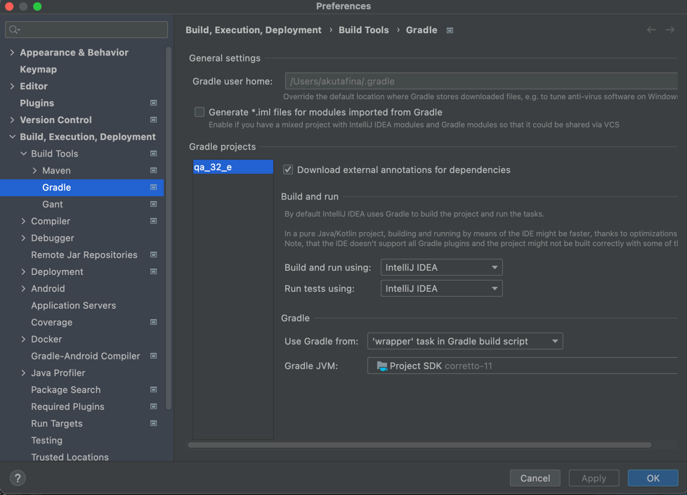

You can run tests from console/terminal with e.g. following commands:

  ./gradlew -Pbrowser=firefox clean testUser
  ./gradlew -Pbrowser=chrome clean testy
  ./gradlew -Pbrowser=chrome clean testSmoky

Check, that you have valid setting in your IntelliJ Idea (IntelliJ Idea Menu > Preferences...)

